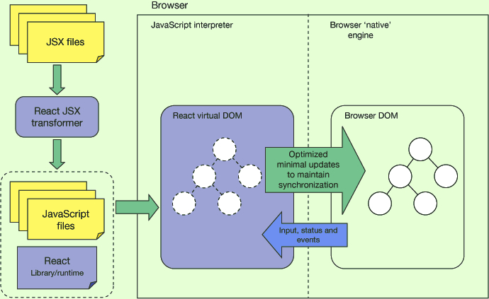

# week 2

## asdf


### JSX


* JavaScript Syntax eXtension
* 경우에 따라 JavaScript XML 이라고도 함
* React에서 JavaScript로 HTML을 쓰는 것처럼 쓸 수 있음
  * JSX의 syntax가 XML/HTML과 비슷
  * 따라서 편하고 가독성이 좋음 (Syntactic sugar, React는 JSX 사용이 필수가 아니지만 이런 장점이 굳)
* JSX는 브라우저가 실행할 수 없음
* 따라서 브라우저가 이해할 수 있는 JavaScript 코드로 변환해주어야 함
* Babel : JavaScript Transfiler
* **한줄요약) JSX는 편하지만 Babel으로 React.createElement로 변환해야 브라우저에서 실행 가능**


#### 💎 교재) Babel에서 변환해 보기


JSX 코드

```
<p>Hello, world!</p>
```

변환된 JS 코드

```
import { jsx as _jsx } from "react/jsx-runtime";
/*#__PURE__*/_jsx("p", {
  children: "Hello, world!"
});
```


강의자료에는 React.createElement 로 변환 되는데\
나는 \_jsx 로 나옴\
이유는 잘 모르겠지만..

#### \_jsx

* React 17부터 도입된 JSX Transform의 새로운 방식
  * [🔗 Introducing the New JSX Transform](https://ko.reactjs.org/blog/2020/09/22/introducing-the-new-jsx-transform.html)
* JSX를 사용할 경우 React가 범위 안에 있어야 하는 것 때문에 개선됨 (React needed to be in scope if you used JSX)
  * import React from 'react'; 를 꼭 써야 하는 것
* 그리고 성능 향상과 단순화가 되었다 함 (There are some performance improvements and simplifications that React.createElement does not allow.)


```
<div className="test">
 <p>Hello, world!</p>
 <Button type="submit">Send</Button>
</div>
```

```
import { jsx as _jsx } from "react/jsx-runtime";
import { jsxs as _jsxs } from "react/jsx-runtime";
/*#__PURE__*/_jsxs("div", {
  className: "test",
  children: [/*#__PURE__*/_jsx("p", {
    children: "Hello, world!"
  }), /*#__PURE__*/_jsx(Button, {
    type: "submit",
    children: "Send"
  })]
});
```

```
<div>
 <p>Count: {count}!</p>
 <button type="button" onClick={() => setCount(count + 1)}>Increase</button>
</div>
```

```
import { jsxs as _jsxs } from "react/jsx-runtime";
import { jsx as _jsx } from "react/jsx-runtime";
/*#__PURE__*/_jsxs("div", {
  children: [/*#__PURE__*/_jsxs("p", {
    children: ["Count: ", count, "!"]
  }), /*#__PURE__*/_jsx("button", {
    type: "button",
    onClick: () => setCount(count + 1),
    children: "Increase"
  })]
});
```


<figure><figcaption><p>React Architecture</p></figcaption></figure>

\[🔗 출처]\([https://jsforall.com/reactjs/how-to-create-react-app-2019-how-virtual-dom-component-work/](https://jsforall.com/reactjs/how-to-create-react-app-2019-how-virtual-dom-component-work/))
