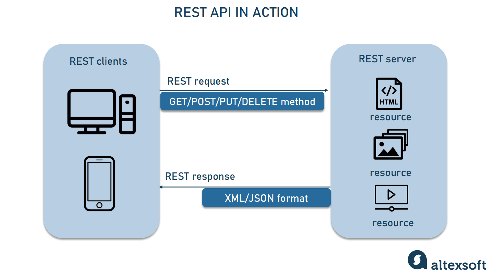

# React Component

## 🥒

component hierarchy

### REST API 와 GraphQL

#### API

[🔗 reference) API란 무엇입니까?](https://aws.amazon.com/ko/what-is/api/)

* Application Programming Interface
  * Application : 소프트웨어
  * Interface : 두 Application 간의 서비스 계약
  * 계약 : 요청과 응답을 사용하여 서로 통신하는 방법을 정의
* **두 소프트웨어 구성 요소가 서로 통신할 수 있게 하는 매커니즘**
* ex) 어떤 시스템이 카카오톡 시스템의 로그인 기능을 사용하고 싶다면\
  카카오톡 로그인 API를 통해 통신
* API 문서 에는 개발자가 요청과 응답을 구성하는 방법에 대한 정보가 들어 있음


#### REST API

[🔗 reference) RESTful API란 무엇입니까?](https://aws.amazon.com/ko/what-is/restful-api/)

* Representational State Transfer
* API 작동 방식에 대해 조건을 부과하는 소프트웨어 아키텍쳐
* 구성
  * RESOURCE - URI
  * Verb - HTTP Method
  * Representations
* 어떻게 작동하는지?
  * client가 RESOURCE가 필요할 때 API를 사용하여 server에 접속
    1. client가 server에 요청을 전송
    2. server가 client를 인증하고 해당 요청을 수행할 수 있는 권한이 있는지 확인
    3. server가 요청을 수신하고 내부적으로 처리
    4. server가 client에 응답을 반환. 요청이 성공했는지 여부와 요청한 정보를 알려줌

<figure><figcaption></figcaption></figure>

[🔗 이미지 출처](https://www.altexsoft.com/blog/rest-api-design/)


* RESOURCE에 대한 행위는 HTTP Method로 표현한다
* HTTP Method (CRUD랑비슷)
  * POST : 등록
  * GET : 조회
  * PUT : 수정
  * DELETE : 삭제
* client request에 포함되는 것
  * 고유 리소스 식별자
    * server는 고유 리소스 식별자로 각 RESOURCE 식별
    * 일반적으로 URL 사용
  * HTTP Method
  * HTTP 헤더
    * client와 server 간에 교환되는 메타데이터
* REST API는 확장성, 유연성, 독립성에 이점이 있다
* REST 특징은 참고 문서 보자


#### GraphQL

[🔗 reference) 공식 깃허브](https://graphql-kr.github.io/)

* Facebook에서 만든 API를 위한 쿼리 언어
  * 쿼리 언어 : 데이터베이스(DB) 또는 정보 시스템(IS: Information System)에 자료를 조작하고 검색하는 데 사용하는 프로그래밍 언어 체계 \[네이버 지식백과] 질의 언어 \[質疑言語, Query Language] (용어로 알아보는 우리시대 DATA)\
    SQL같은거
* 타입 시스템을 사용하여 쿼리를 실행하는 서버사이드 런타임
  * 타입과 필드를 정의하고 각 타입의 필드에 대한 함수로 구현
  * ex) 로그인한 사용자가 누구인지(me)와 해당 사용자의 이름(name)을 가져오는 GraphQL 서비스

```
type Query {
 me: User
}

type User {
 id: ID
 name: String
}
```

```
function Query_me(request) {
  return request.auth.user;
}

function User_name(user) {
  return user.getName();
}
```

* REST API는 여러 URL에서 데이터를 받아와야 하지만 GraphQL API는 **한번의 요청으로 앱에 필요한 모든 데이터를 가져옵니다.**
  * client가 필요한 데이터만 가져오도록 한 번에 쿼리를 보낼 수 있음
  * 선언적, 직관적
* 강력한 개발자 도구 지원.. 개발자 친화적


#### REST API vs GraphQL

[🔗GraphQL is the better REST](https://www.howtographql.com/basics/1-graphql-is-the-better-rest/)

* GraphQL github는 "GraphQL은 더 나은 REST" 라고 소개함
* REST API의 한계?
  * Under-Fetching : 필요한 데이터를 가져오려면 여러 API를 호출해야 함
  * Over-Fetching : 나한테 필요 없는 데이터도 반환 받아야 함 = RESOURCE 낭비
* REST는 필요한 데이터를 여러 endpoints에 액세스 하여 수집하지만 (여러번요청)
* GraphQL은 서버에 단일 요청으로 수집 가능

**endpoint**

* API가 server에서 RESOURCE에 접근할 수 있도록 하는 URL

<figure><figcaption></figcaption></figure>

\[🔗이미지 출처 [https://www.apollographql.com/blog/graphql/basics/graphql-vs-rest/](https://www.apollographql.com/blog/graphql/basics/graphql-vs-rest/)]
